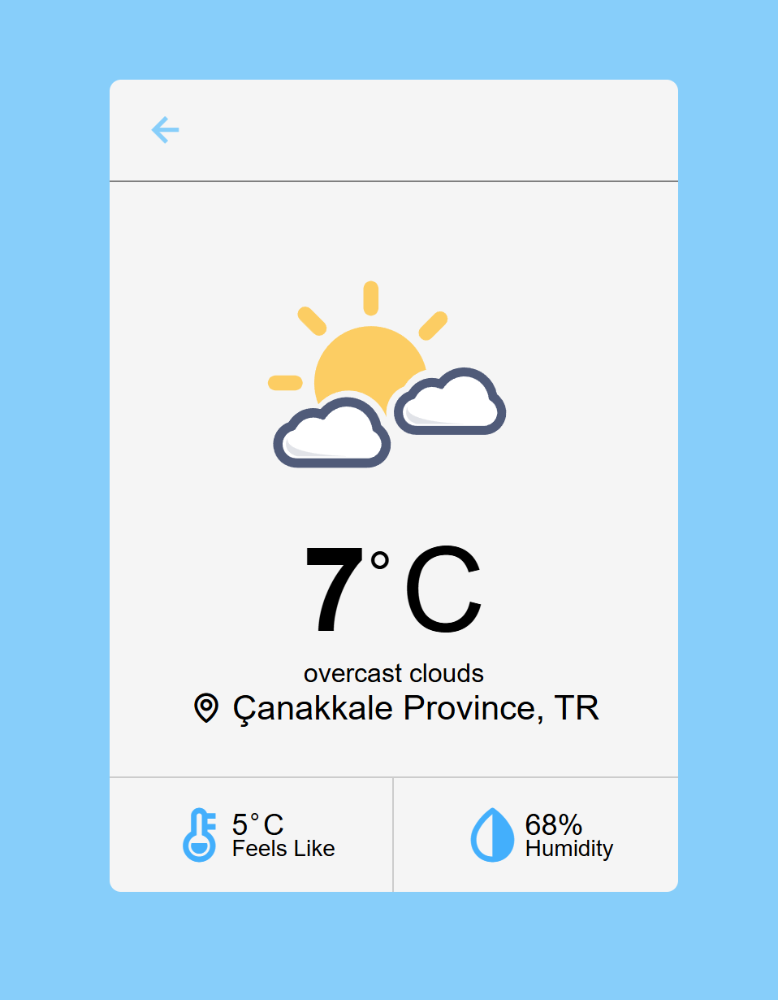

# 🌦️ Hava Durumu Web Uygulaması

Bu proje, **HTML, CSS ve JavaScript** kullanılarak geliştirilmiş basit bir **hava durumu web uygulamasıdır**. Kullanıcıdan alınan şehir bilgisine göre, OpenWeather API üzerinden güncel hava durumu verilerini gösterir.

🔗 **Canlı Demo (GitHub Pages):**
[https://tuana-sultan.github.io/hava-durumu-projesi/](https://tuana-sultan.github.io/hava-durumu-projesi/)

---

## 🚀 Özellikler

* 🌍 Şehir adına göre hava durumu sorgulama
* 🌡️ Sıcaklık, hava durumu açıklaması ve ikon gösterimi
* 📱 Responsive (mobil uyumlu) tasarım
* ⚠️ Hatalı şehir girişlerinde kullanıcıya bilgilendirme

---

## 🛠️ Kullanılan Teknolojiler

* **HTML5**
* **CSS3**
* **JavaScript (Vanilla JS)**
* **OpenWeather API**

---

## 📂 Proje Yapısı

```
HAVA DURUMU PROJESİ/
│
├── index.html
├── style.css
├── script.js
├── config.example.js   # API key örnek dosyası
├── .gitignore          # Gizli dosyalar
└── README.md
```

---

## 🔐 API Key Kullanımı 

Bu proje **public (herkese açık)** bir GitHub reposu olduğu için **API key güvenliği** dikkate alınmıştır.

* Gerçek API key **GitHub'a eklenmemiştir** ❌
* API key, `.gitignore` ile gizlenen `config.js` dosyasında tutulur

---
## 📷 Ekran Görüntüsü


---

## 👩‍💻 Geliştirici

**Tuana Sultan**
Bilgisayar Programcılığı Öğrencisi
GitHub: [https://github.com/tuana-sultan](https://github.com/tuana-sultan)

---

✨ Bu proje, eğitim ve portfolyo amacıyla geliştirilmiştir.
